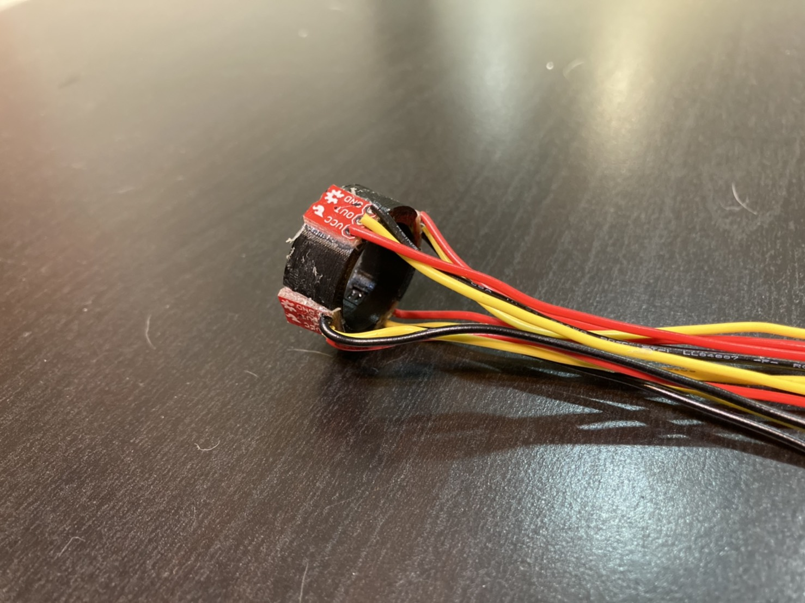
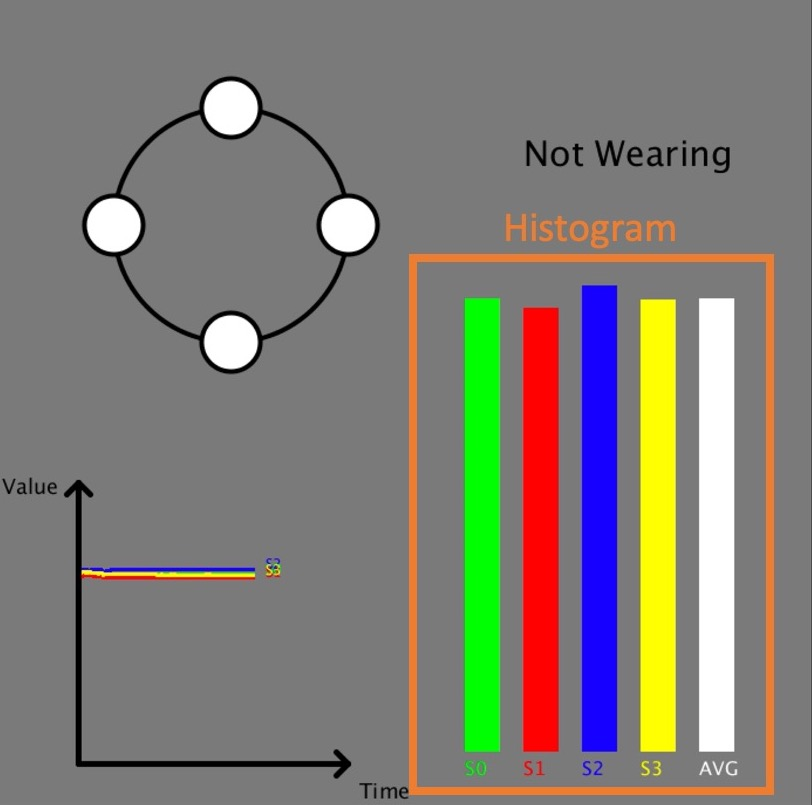
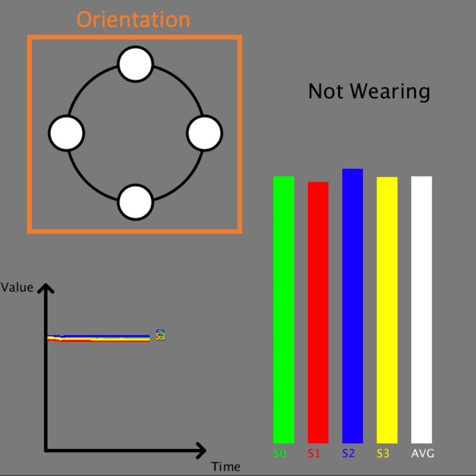
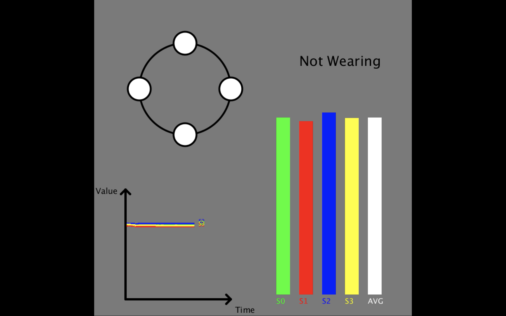
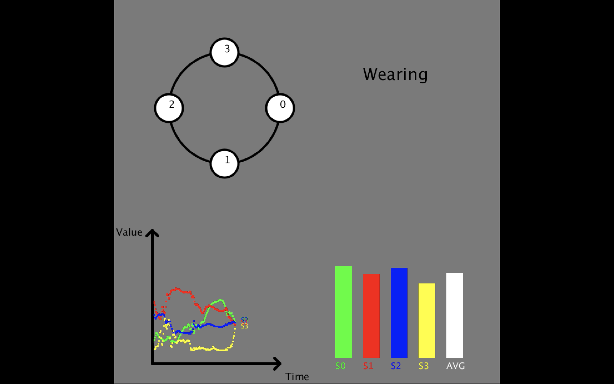
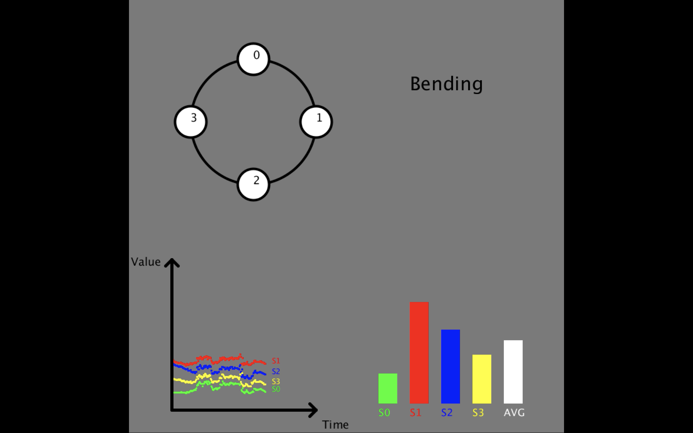
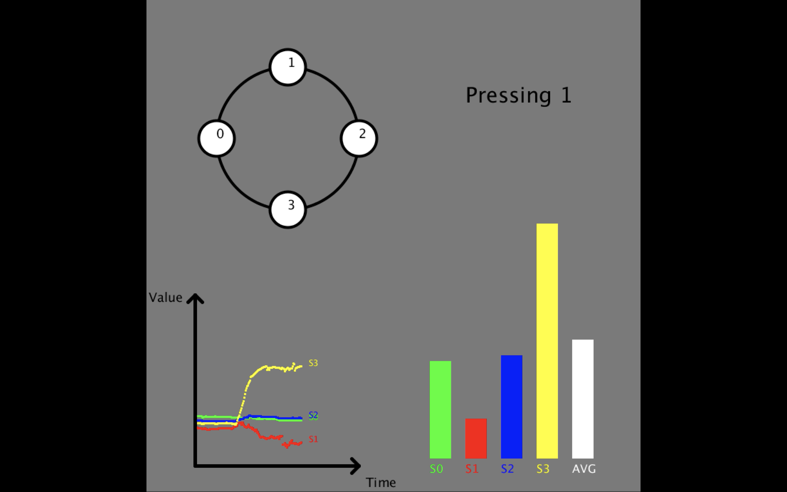
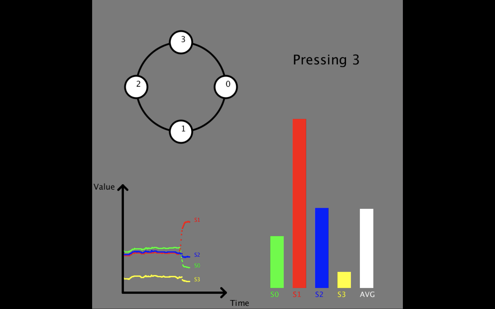

<!-- PROJECT LOGO -->
 

  
  <h3 align="center">iRing</h3>
  

    Intelligent Ring Using Infrared Reflection
     
    <a href="https://youtu.be/65YDXLv2ujc">View Demo</a>
  

<!-- ABOUT THE PROJECT -->
## About The Project

This is a intelligent ring using **Infrared Reflection**. 4 IR sensors are attached on the 3D-printed Ring. Data from each sensor were collected in four states and was used to recognize current states in real time. 
  1. Not Wearing
  2. Wearing (0, 90, 180, 270 degree)
  3. Bending
  4. Pressing

The states are determined by the distance between finger and ring since the result will be different in each situation. Arduino and Python are used to collect data; Processing is used to build the interface.

### Built With

* Arduino UNO
* [IR sensor - QRE1113](https://www.sparkfun.com/products/9453)
* 3D-Printed Ring
* [Processing](https://processing.org)

## Demo Images
iRing is able to recognize 4 states: Not Wearing, Wearing, Bending and Pressing. 

#### Histogram
The X-axis of the histogram is Sensor number; Y-axis is the received data of the sensor. 

  

#### Orientation
The number in the circle shows the Sensor number, which is able to tell the orientation of iRing.

  

### Not Wearing
Nothing blocks the IR sensor while not wearing, the received data of the sensors = 255.

  

### Wearing
While wearing the ring, distance between ring and finger is in average. We can also tell the orientation of the ring from the picture in the upper left corner.

  

### Bending
Data jitters while bending finger.

  

### Pressing
One of the received data will be significantly larger when pressing sensor.

  
  

